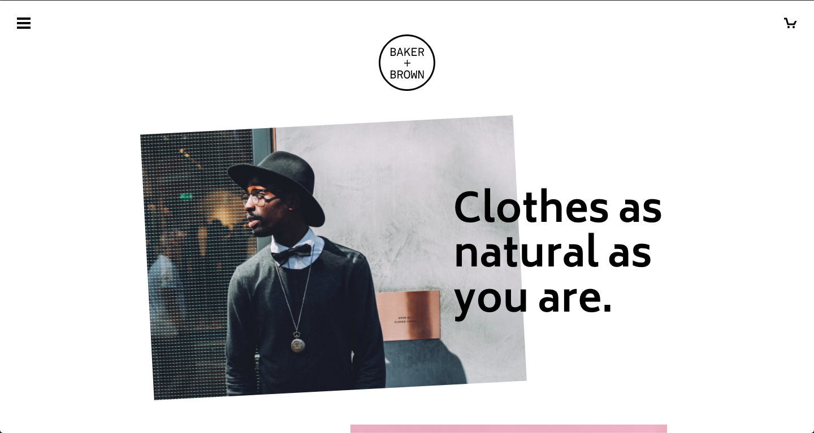
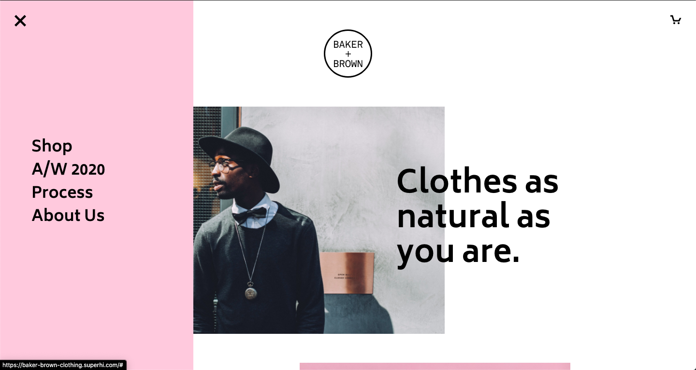
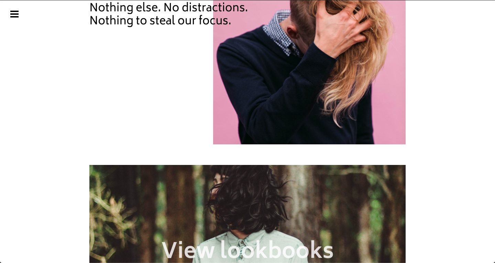

# Baker + Brown
Site for clothing brand Baker + Brown.

## Table of contents
* [General info](#general-info)
* [Screenshots](#screenshots)
* [Technologies](#technologies)
* [Demo](#demo)
* [Features](#features)
* [Status](#status)
* [Contact](#contact)

## General info
This was the sixth project on the [Superhi Foundation](https://superhi.com/courses/html-css-javascript-foundation) course. It continued to build on the javacript learnt so far. Featuring a slide out menu and transforms on hover.

## Screenshots

## Technologies
* HTML5
* CSS3
* jQuery v3.5.1

## Demo
[Live Demo](https://baker-brown-clothing.superhi.com/)

## Features
List of features:
* Slide out menu
* Hover transform effects.
* Flexible layout using CSS flexbox.

## Status
Project is: _finished_ and complete for the course.
 
## Contact
Created by [@guybroadhurst](https://www.guybroadhurst.co.uk/) - feel free to contact me!
